[](http://quantlet.de/)

## [](http://quantlet.de/) **BLEMevaluateEnergyPreds** [](http://quantlet.de/)

```yaml


Name of Quantlet: BLEMevaluateEnergyPreds

Published in: Forecasting in blockchain-based smart grids: Testing a prerequisite for the implementation of local energy markets

Description: Generates graphs and tables to evaluate prediction performance of naive predictor, LASSO, and LSTM models.

Keywords: mean absolute error, MAE, mean absolute percentage error, MAPE, root mean squared error, RMSE, normalised root mean squared error, NRMSE, mean absolute scaled error, MASE, heatmap, boxplot, error analysis, prediction accuracy, model performance, energy prediction, average performance

Author: Michael Kostmann

See also:
- BLEMdataGlimpse
- BLEMdescStatEnergyData
- BLEMevaluateMarketSim
- BLEMmarketSimulation
- BLEMplotEnergyData
- BLEMplotEnergyPreds
- BLEMplotPredErrors
- BLEMpredictLASSO
- BLEMpredictLSTM
- BLEMpredictNaive
- BLEMtuneLSTM
- BLEMplotScalingForLSTM

Submitted:  26.10.2018

Datafile:
- 100 consumer datasets (named "consumer-00000xxx.csv")
- 100 prosumer datasets (named "producer-00000xxx.csv")
- consumer predictions:
    - naive_predictions.csv
    - LASSO_predictions.csv
    - LSTM_predictions.csv
- prosumer predictions
    - naive_predictions.csv
    - LASSO_predictions.csv
    - LSTM_predictions.csv

Input: true consumption and production data and predicted consumption and production data

Output:
- boxplots and heatmaps of naive, LASSO, and LSTM model performance according to MAE, MAPE, MASE, RMSE, and NRMSE on 88 consumer data sets
- boxplots and heatmaps of naive, LASSO, and LSTM model performance according to MAE, MASE, and RMSE on 12 prosumer data sets
- tables summarising the model performance across all consumer and prosumer data sets 
```

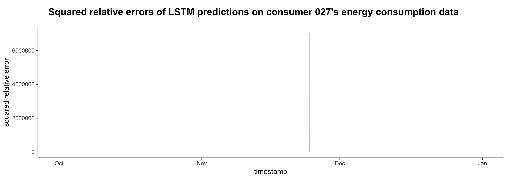

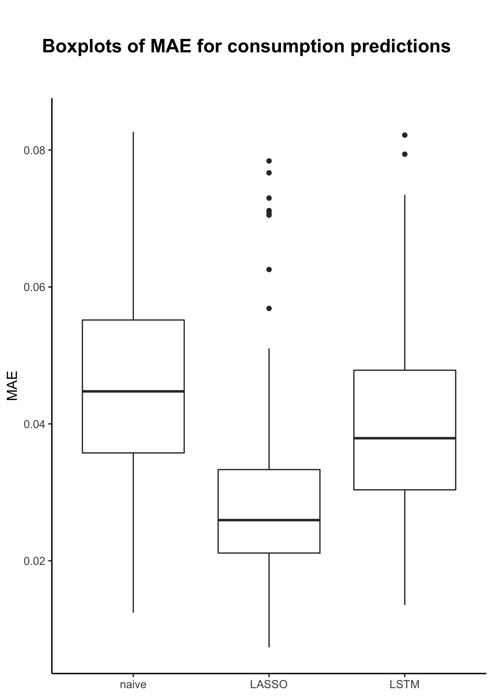

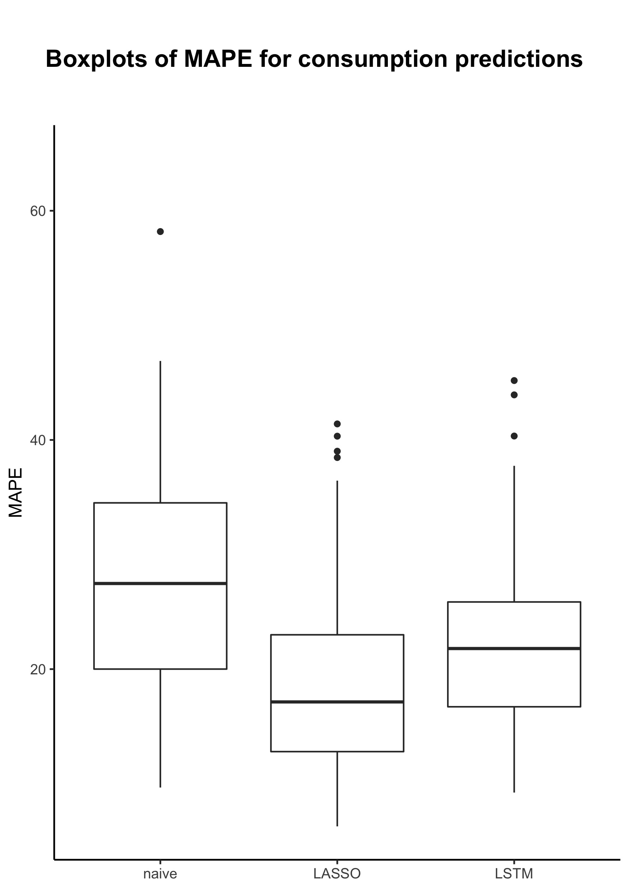

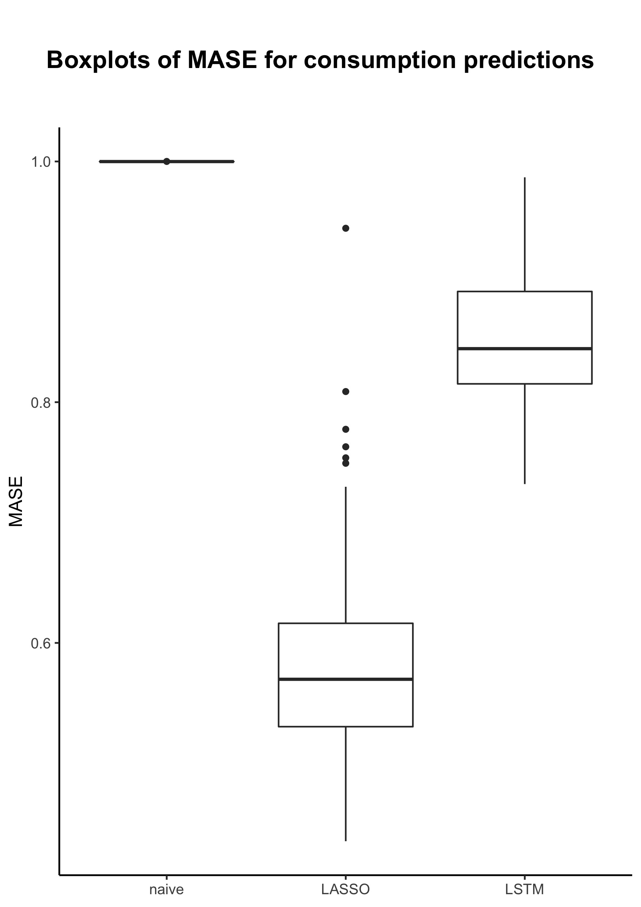

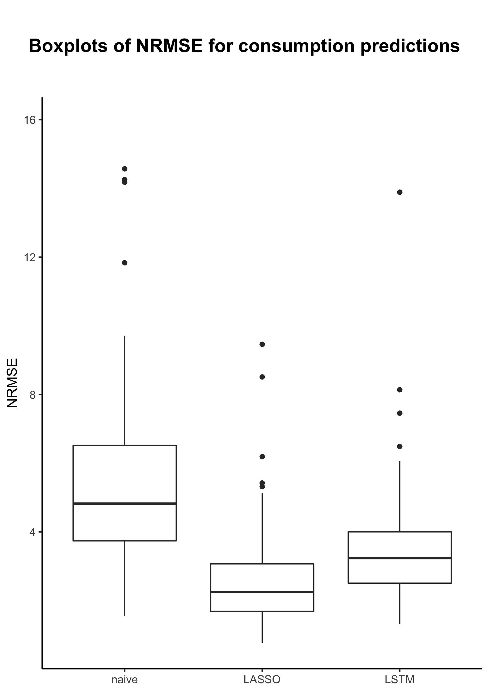

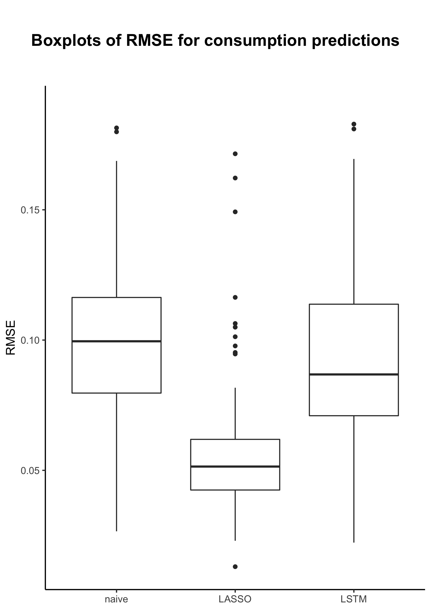

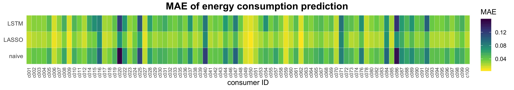

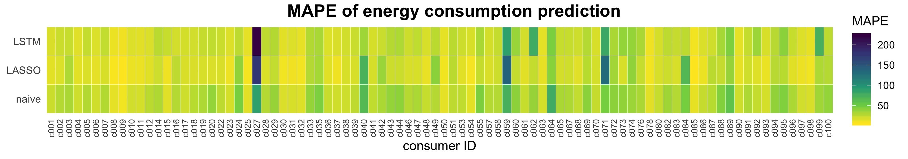

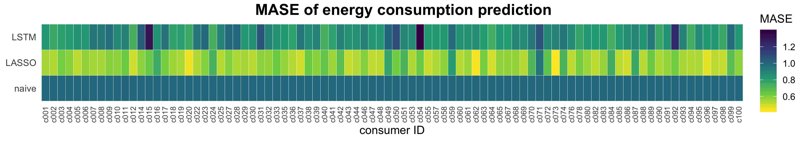

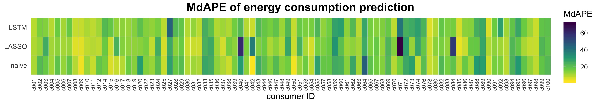

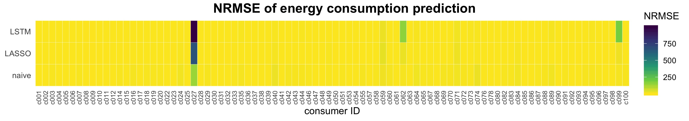

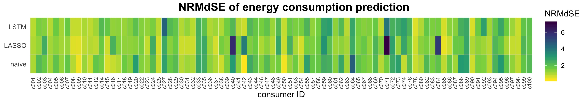

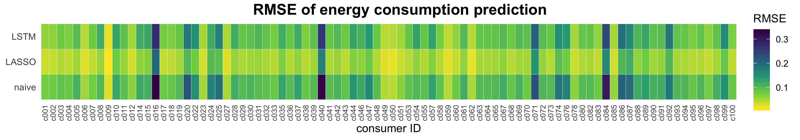

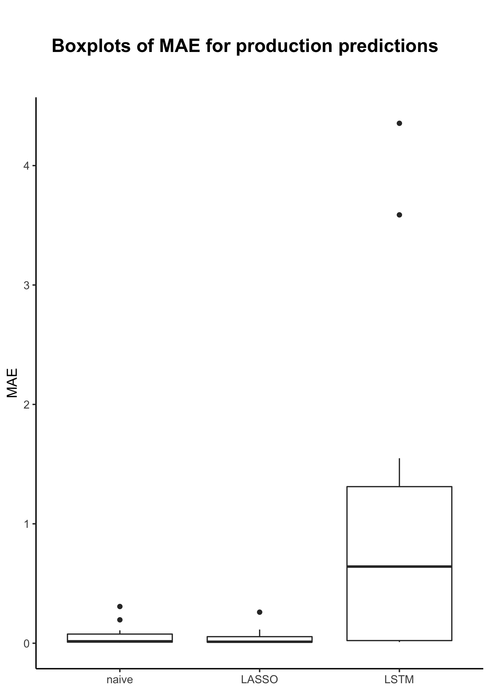

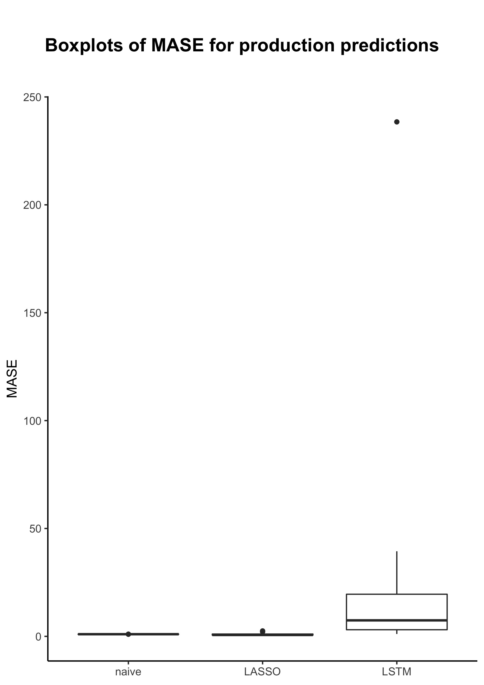

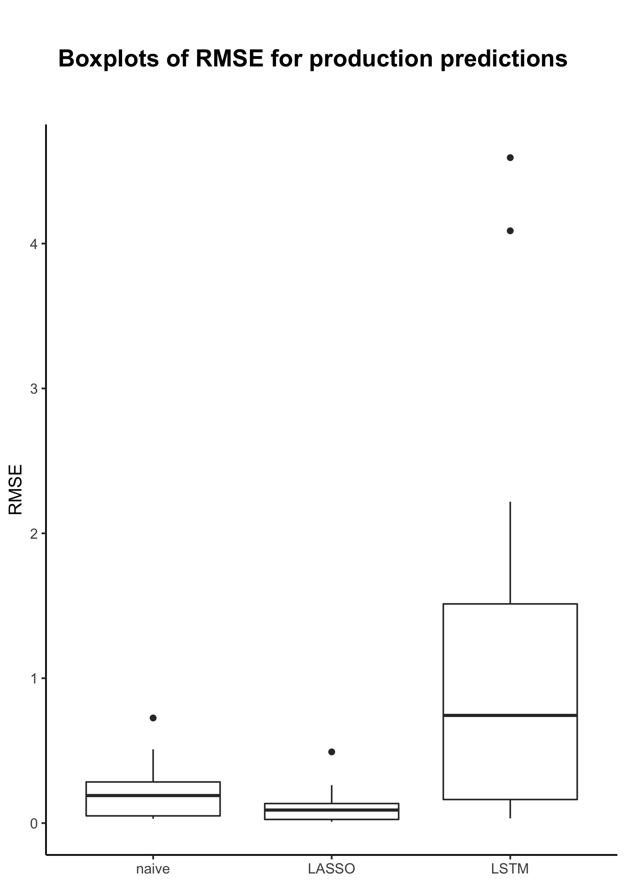

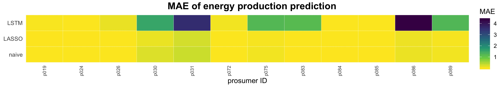

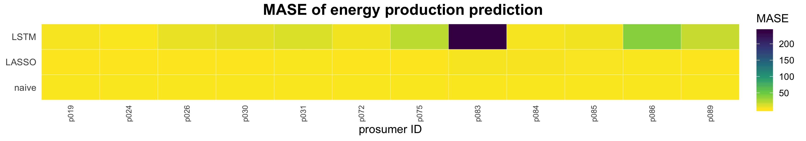

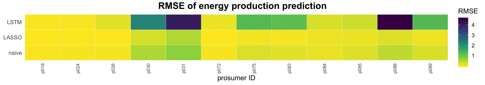

### R Code
```r


## Plot heatmaps and boxplots of error measures and
## plot squared relative squared errors of consumer 027
## Author: Michael Kostmann


# Options
options(scipen = 999)

# Load packages
packages  = c("reshape",
              "cowplot")
invisible(lapply(packages, library, character.only = TRUE))

# Load user-defined functions
functions = c("FUN_loadErrorMeasures.R",
              "FUN_getTargets.R")
invisible(lapply(functions, source))

# Function for easy string pasting
"%&%"     = function(x, y) {paste(x, y, sep = "")}


## CONSUMER ##


# Define vector with names of error measures
measures_c  = c("MAE", "MAPE", "MASE", "RMSE", "NRMSE")

# Define vector of datasets to exclude from error analysis
remove   = c(13, 21, 34, 45, 52, 56, 66, 75, 77, 79, 81)

# Load error measures
error_measures_c = loadErrorMeasures("predictions/consumer/",
                                      return = measures_c,
                                      remove = remove)

# Create index vector for x-Axis labels
id_c = read.csv("consumer_labels.csv",
                stringsAsFactors = FALSE)[-c(26, remove), 2]

# Loop over specified error measures
for(i in measures_c) {
    
    # Bind absolute error measures to one dataframe
    assign(i, data.frame("ID"    = id_c,
                         "naive" = error_measures_c[["naive_"%&%i]],
                         "LASSO" = error_measures_c[["LASSO_"%&%i]],
                         "LSTM"  = error_measures_c[["LSTM_"%&%i]]))
    
    # Reshape into long-format
    long = melt(get(i), id.vars = "ID")
    
    # Plot heatmap
    p_title = ggdraw() + 
        draw_label(i%&%" of energy consumption prediction",
                   size     = 16,
                   fontface = "bold")
    
    p = long %>% 
        ggplot(aes(ID, variable)) + 
        geom_tile(aes(fill = value),
                  color = "white") +
        scale_x_discrete(expand = c(0, 0)) +
        scale_y_discrete(expand = c(0, 0)) +
        scale_fill_viridis_c(begin = 1,
                             end = 0,
                             option = "viridis",
                             name = i) +
        theme_minimal(base_size = 12) +
        theme(axis.title.y = element_blank(),
              axis.text.x  = element_text(angle = 90,
                                          vjust = 0.5,
                                          size  = 8)) +
        xlab("consumer ID")
    
    plot_grid(p_title, p, ncol = 1, rel_heights = c(0.15, 1))
    ggsave("c_heatmap_"%&%i%&%".jpg",
           height = (8.267/4), width = 11.692)
    
    # Plot boxplot
    p_title_b <- ggdraw() + 
        draw_label("Boxplots of "%&%i%&%" for consumption predictions",
                   size     = 16,
                   fontface = "bold")
    
    p_b <- long %>%
        ggplot(aes(variable, value)) +
        geom_boxplot(aes(variable, value)) +
        scale_y_continuous(limits = quantile(long$value,
                                             c(0.0, 0.95),
                                             na.rm = TRUE)) +
        theme_classic(base_size = 12) +
        theme(axis.title.x = element_blank()) +
        ylab(i)
    
    plot_grid(p_title_b, p_b, ncol = 1, rel_heights = c(0.15, 1))
    ggsave("c_boxplot_"%&%i%&%".jpg",
           height = 8.267, width = 11.692/2)
    
}


### Plot relative squared errors of consumer 027


# Load prediction dataset
predictions_all = read.csv("predictions/consumer/LSTM_predictions.csv")

# Retrieve predictions
predictions = predictions_all[, 27]

# Get true values
targets = getTargets(path = "../data/consumer/",
                     id   = "consumer-00000027",
                     min  = "2017-10-01 00:03",
                     max  = "2018-01-01 00:00")[1:length(predictions)]

# Generate dataframe
n    = length(predictions)
data = data.frame("time"   = seq.POSIXt(as.POSIXct("2017-10-01 00:00"),
                                        as.POSIXct("2018-01-01 00:00"),
                                        by = 900)[2:(n+1)],
                  "value" = ((predictions - targets[1:n]) / targets[1:n])^2)

# Plot
p_title = ggdraw() + 
    draw_label(paste0("Squared relative errors of LSTM predictions",
                      " on consumer 027's energy consumption data"),
               size     = 16,
               fontface = "bold")

p = ggplot(data = data,
           mapping = aes(time, value)) +
    geom_line() +
    theme_classic(base_size = 12) +
    ylab("squared relative error") +
    xlab("timestamp")

plot_grid(p_title, p, ncol = 1, rel_heights = c(0.15, 1))
ggsave("c027_squarederrors.jpg",
       height = (8.267/2), width = 11.692)


### Median relative error measures (MdAPE and NRMdSE)


# Define vector with names of error measures
measures_median         = c("MdAPE", "NRMdSE")

# Load error measures
error_measures_c_median = loadErrorMeasures("predictions/consumer_median/",
                                            return = measures_median,
                                            remove = remove)

# Combine into dataframe
for(i in measures_median) {
    
    # Bind absolute error measures to one dataframe
    assign(i, data.frame("ID"    = id_c,
                         "naive" = error_measures_c_median[["naive_"%&%i]],
                         "LASSO" = error_measures_c_median[["LASSO_"%&%i]],
                         "LSTM"  = error_measures_c_median[["LSTM_"%&%i]]))
    
    # Reshape into long-format
    long = melt(get(i), id.vars = "ID")
    
    # Plot heatmap
    p_title1 = ggdraw() + 
        draw_label(i%&%" of energy consumption prediction",
                   size     = 16,
                   fontface = "bold")
    
    p1 = long %>% 
         ggplot(aes(ID, variable)) + 
         geom_tile(aes(fill = value),
                   color = "white") +
         scale_x_discrete(expand = c(0, 0)) +
         scale_y_discrete(expand = c(0, 0)) +
         scale_fill_viridis_c(begin = 1,
                              end = 0,
                              option = "viridis",
                              name = i) +
         theme_minimal(base_size = 12) +
         theme(axis.title.y = element_blank(),
               axis.text.x  = element_text(angle = 90,
                                           vjust = 0.5,
                                           size  = 8)) +
         xlab("consumer ID")
    
    plot_grid(p_title1, p1, ncol = 1, rel_heights = c(0.15, 1))
    ggsave("c_heatmap_"%&%i%&%".jpg",
           height = (8.267/4), width = 11.692)
    
}


## PROSUMER ##


# Define vector with names of error measures
measures_p  = c("MAE", "MASE", "RMSE")

# Load error measures
error_measures_p = loadErrorMeasures("predictions/prosumer/",
                                      return = measures_p,
                                      remove = NULL)

# Create index vector for x-Axis labels
id_p = read.csv("prosumer_labels.csv",
                stringsAsFactors = FALSE)[c(19, 24, 26, 30, 31, 72,
                                            75,83, 84, 85, 86, 89), 2]

# Combine into dataframe
for(i in measures_p) {
    
    # Bind absolute error measures to one dataframe
    assign(i, data.frame("ID"    = id_p,
                         "naive" = error_measures_p[["naive_"%&%i]],
                         "LASSO" = error_measures_p[["LASSO_"%&%i]],
                         "LSTM"  = error_measures_p[["LSTM_"%&%i]]))
    
    # Reshape into long-format
    long = melt(get(i), id.vars = "ID")
    
    # Plot heatmap
    p_title2 = ggdraw() + 
        draw_label(i%&%" of energy production prediction",
                   size     = 16,
                   fontface = "bold")
    
    p2 = long %>%
        ggplot(aes(ID, variable)) + 
        geom_tile(aes(fill = value),
                  color = "white") +
        scale_x_discrete(expand = c(0, 0)) +
        scale_y_discrete(expand = c(0, 0)) +
        scale_fill_viridis_c(begin = 1,
                             end = 0,
                             option = "viridis",
                             name = i) +
        theme_minimal(base_size = 12) +
        theme(axis.title.y = element_blank(),
              axis.text.x  = element_text(angle = 90,
                                          vjust = 0.5,
                                          size  = 8)) +
        xlab("prosumer ID")
    
    plot_grid(p_title2, p2, ncol = 1, rel_heights = c(0.15, 1))
    ggsave("p_heatmap_"%&%i%&%".jpg",
           height = (8.267/4), width = 11.692)
    
    # Plot boxplot
    p_title2_b <- ggdraw() + 
        draw_label("Boxplots of "%&%i%&%" for production predictions",
                   size     = 16,
                   fontface = "bold")
    
    p2_b <- long %>%
        ggplot(aes(variable, value)) +
        geom_boxplot(aes(variable, value)) +
        theme_classic(base_size = 12) +
        theme(axis.title.x = element_blank()) +
        ylab(i)
    
    plot_grid(p_title2_b, p2_b, ncol = 1, rel_heights = c(0.15, 1))
    ggsave("p_boxplot_"%&%i%&%".jpg",
           height = 8.267, width = 11.692/2)
    
}


###############################################################################


## Calculate means  and medians of error measures and save as csv-file
## Author: Michael Kostmann


# Load user-defined functions
functions = c("FUN_loadErrorMeasures.R")
invisible(lapply(functions, source))

# Function for easy string pasting
"%&%"     = function(x, y) {paste(x, y, sep = "")}


# Define vector with names of error measures
measures        = c("MAE", "MAPE", "MASE", "MSE", "RMSE", "NRMSE")
measures_median = c("MAE", "MdAPE", "MASE", "MSE", "RMSE", "NRMdSE")


### Mean of error measures


## CONSUMER ##


# Define vector of datasets to exclude from error analysis
remove   = c(13, 21, 34, 45, 52, 56, 66, 75, 77, 79, 81)

# Load error measures
error_measures_c        = loadErrorMeasures("predictions/consumer/",
                                            return = measures,
                                            remove = remove)

error_measures_c_median = loadErrorMeasures("predictions/consumer_median/",
                                            return = measures_median,
                                            remove = remove)

# Generate dataframe for table
avg_errM_c_mean = data.frame(
    
    "Model"  = c("LSTM",
                 "LASSO",
                 "Benchmark",
                 "Improvement LSTM (in %)",
                 "Improvement LASSO (in %)"),
    
    
    "MAE"    = c(mean(error_measures_c[["LSTM_MAE"]]),
                 
                 mean(error_measures_c[["LASSO_MAE"]]),
                 
                 mean(error_measures_c[["naive_MAE"]]),
                 
                 100*(mean(error_measures_c[["naive_MAE"]]) -
                          mean(error_measures_c[["LSTM_MAE"]])) /
                     mean(error_measures_c[["naive_MAE"]]),
                 
                 100*(mean(error_measures_c[["naive_MAE"]]) -
                          mean(error_measures_c[["LASSO_MAE"]])) /
                     mean(error_measures_c[["naive_MAE"]])),
    
    
    "RMSE"   = c(mean(error_measures_c[["LSTM_RMSE"]]),
                 
                 mean(error_measures_c[["LASSO_RMSE"]]),
                 
                 mean(error_measures_c[["naive_RMSE"]]),
                 
                 100*(mean(error_measures_c[["naive_RMSE"]]) -
                          mean(error_measures_c[["LSTM_RMSE"]])) /
                     mean(error_measures_c[["naive_RMSE"]]),
                 
                 100*(mean(error_measures_c[["naive_RMSE"]]) -
                          mean(error_measures_c[["LASSO_RMSE"]])) /
                     mean(error_measures_c[["naive_RMSE"]])),
    
    
    "MAPE"   = c(mean(error_measures_c[["LSTM_MAPE"]]),
                 
                 mean(error_measures_c[["LASSO_MAPE"]]),
                 
                 mean(error_measures_c[["naive_MAPE"]]),
                 
                 100*(mean(error_measures_c[["naive_MAPE"]]) -
                          mean(error_measures_c[["LSTM_MAPE"]])) /
                     mean(error_measures_c[["naive_MAPE"]]),
                 
                 100*(mean(error_measures_c[["naive_MAPE"]]) -
                          mean(error_measures_c[["LASSO_MAPE"]])) /
                     mean(error_measures_c[["naive_MAPE"]])),
    
    
    # "MdAPE"  = c(mean(error_measures_c_median[["LSTM_MdAPE"]]),
    # 
    #              mean(error_measures_c_median[["LASSO_MdAPE"]]),
    # 
    #              mean(error_measures_c_median[["naive_MdAPE"]]),
    # 
    #              100*(mean(error_measures_c_median[["naive_MdAPE"]]) -
    #                       mean(error_measures_c_median[["LSTM_MdAPE"]])) /
    #                  mean(error_measures_c_median[["naive_MdAPE"]]),
    # 
    #              100*(mean(error_measures_c_median[["naive_MdAPE"]]) -
    #                       mean(error_measures_c_median[["LASSO_MdAPE"]])) /
    #                  mean(error_measures_c_median[["naive_MdAPE"]])),
    
    
    "NRMSE"  = c(mean(error_measures_c[["LSTM_NRMSE"]]),
                 
                 mean(error_measures_c[["LASSO_NRMSE"]]),
                 
                 mean(error_measures_c[["naive_NRMSE"]]),
                 
                 100*(mean(error_measures_c[["naive_NRMSE"]]) -
                          mean(error_measures_c[["LSTM_NRMSE"]])) /
                     mean(error_measures_c[["naive_NRMSE"]]),
                 
                 100*(mean(error_measures_c[["naive_NRMSE"]]) -
                          mean(error_measures_c[["LASSO_NRMSE"]])) /
                     mean(error_measures_c[["naive_NRMSE"]])),
    
    
    # "NRMdSE" = c(mean(error_measures_c_median[["LSTM_NRMdSE"]]),
    # 
    #              mean(error_measures_c_median[["LASSO_NRMdSE"]]),
    # 
    #              mean(error_measures_c_median[["naive_NRMdSE"]]),
    # 
    #              100*(mean(error_measures_c_median[["naive_NRMdSE"]]) -
    #                       mean(error_measures_c_median[["LSTM_NRMdSE"]])) /
    #                  mean(error_measures_c_median[["naive_NRMdSE"]]),
    # 
    #              100*(mean(error_measures_c_median[["naive_NRMdSE"]]) -
    #                       mean(error_measures_c_median[["LASSO_NRMdSE"]])) /
    #                  mean(error_measures_c_median[["naive_NRMdSE"]])),
    
    
    "MASE"   = c(mean(error_measures_c[["LSTM_MASE"]]),
                 
                 mean(error_measures_c[["LASSO_MASE"]]),
                 
                 mean(error_measures_c[["naive_MASE"]]),
                 
                 100*(mean(error_measures_c[["naive_MASE"]]) -
                          mean(error_measures_c[["LSTM_MASE"]])) /
                     mean(error_measures_c[["naive_MASE"]]),
                 
                 100*(mean(error_measures_c[["naive_MASE"]]) -
                          mean(error_measures_c[["LASSO_MASE"]])) /
                     mean(error_measures_c[["naive_MASE"]]))
)

# Save to file  
write.csv(avg_errM_c_mean, file = "tables/avg_errorMeasures_c.csv")
# write.csv(avg_errM_c_mean, file = "tables/avg_errorMeasures_c_median.csv")


### PROSUMER ###


# Load error measures
error_measures_p = loadErrorMeasures("predictions/prosumer/",
                                     return = measures,
                                     remove = NULL)

# Generate dataframe for table
avg_errM_p_mean = data.frame(
    
    "Model" = c("LSTM",
                "LASSO",
                "Benchmark",
                "Improvement LSTM (in %)",
                "Improvement LASSO (in %)"),
    
    
    "MAE"   = c(mean(error_measures_p[["LSTM_MAE"]]),
                
                mean(error_measures_p[["LASSO_MAE"]]),
                
                mean(error_measures_p[["naive_MAE"]]),
                
                100*(mean(error_measures_p[["naive_MAE"]]) -
                         mean(error_measures_p[["LSTM_MAE"]])) /
                    mean(error_measures_p[["naive_MAE"]]),
                
                100*(mean(error_measures_p[["naive_MAE"]]) -
                         mean(error_measures_p[["LASSO_MAE"]])) /
                    mean(error_measures_p[["naive_MAE"]])),
    
    
    "RMSE"  = c(mean(error_measures_p[["LSTM_RMSE"]]),
                
                mean(error_measures_p[["LASSO_RMSE"]]),
                
                mean(error_measures_p[["naive_RMSE"]]),
                
                100*(mean(error_measures_p[["naive_RMSE"]]) -
                         mean(error_measures_p[["LSTM_RMSE"]])) /
                    mean(error_measures_p[["naive_RMSE"]]),
                
                100*(mean(error_measures_p[["naive_RMSE"]]) -
                         mean(error_measures_p[["LASSO_RMSE"]])) /
                    mean(error_measures_p[["naive_RMSE"]])),
    
    
    "MASE"  = c(mean(error_measures_p[["LSTM_MASE"]]),
                
                mean(error_measures_p[["LASSO_MASE"]]),
                
                mean(error_measures_p[["naive_MASE"]]),
                
                100*(mean(error_measures_p[["naive_MASE"]]) -
                         mean(error_measures_p[["LSTM_MASE"]])) /
                    mean(error_measures_p[["naive_MASE"]]),
                
                100*(mean(error_measures_p[["naive_MASE"]]) -
                         mean(error_measures_p[["LASSO_MASE"]])) /
                    mean(error_measures_p[["naive_MASE"]]))
)

# Save to file
write.csv(avg_errM_p_mean, file = "tables/avg_errorMeasures_p.csv")


### Median of error measures


###  CONSUMER  ###


# Generate dataframe for table
avg_errM_c_median = data.frame(
    
    "Model"  = c("LSTM",
                 "LASSO",
                 "Benchmark",
                 "Improvement LSTM (in %)",
                 "Improvement LASSO (in %)"),
    
    
    "MAE"    = c(median(error_measures_c[["LSTM_MAE"]]),
                 
                 median(error_measures_c[["LASSO_MAE"]]),
                 
                 median(error_measures_c[["naive_MAE"]]),
                 
                 100*(median(error_measures_c[["naive_MAE"]]) -
                          median(error_measures_c[["LSTM_MAE"]])) /
                     median(error_measures_c[["naive_MAE"]]),
                 
                 100*(median(error_measures_c[["naive_MAE"]]) -
                          median(error_measures_c[["LASSO_MAE"]])) /
                     median(error_measures_c[["naive_MAE"]])),
    
    
    "RMSE"   = c(median(error_measures_c[["LSTM_RMSE"]]),
                 
                 median(error_measures_c[["LASSO_RMSE"]]),
                 
                 median(error_measures_c[["naive_RMSE"]]),
                 
                 100*(median(error_measures_c[["naive_RMSE"]]) -
                          median(error_measures_c[["LSTM_RMSE"]])) /
                     median(error_measures_c[["naive_RMSE"]]),
                 
                 100*(median(error_measures_c[["naive_RMSE"]]) -
                          median(error_measures_c[["LASSO_RMSE"]])) /
                     median(error_measures_c[["naive_RMSE"]])),
    
    
    "MAPE"   = c(median(error_measures_c[["LSTM_MAPE"]]),
                 
                 median(error_measures_c[["LASSO_MAPE"]]),
                 
                 median(error_measures_c[["naive_MAPE"]]),
                 
                 100*(median(error_measures_c[["naive_MAPE"]]) -
                          median(error_measures_c[["LSTM_MAPE"]])) /
                     median(error_measures_c[["naive_MAPE"]]),
                 
                 100*(median(error_measures_c[["naive_MAPE"]]) -
                          median(error_measures_c[["LASSO_MAPE"]])) /
                     median(error_measures_c[["naive_MAPE"]])),
    
    
    "NRMSE"  = c(median(error_measures_c[["LSTM_NRMSE"]]),
                 
                 median(error_measures_c[["LASSO_NRMSE"]]),
                 
                 median(error_measures_c[["naive_NRMSE"]]),
                 
                 100*(median(error_measures_c[["naive_NRMSE"]]) -
                          median(error_measures_c[["LSTM_NRMSE"]])) /
                     median(error_measures_c[["naive_NRMSE"]]),
                 
                 100*(median(error_measures_c[["naive_NRMSE"]]) -
                          median(error_measures_c[["LASSO_NRMSE"]])) /
                     median(error_measures_c[["naive_NRMSE"]])),
    
    
    "MASE"   = c(median(error_measures_c[["LSTM_MASE"]]),
                 
                 median(error_measures_c[["LASSO_MASE"]]),
                 
                 median(error_measures_c[["naive_MASE"]]),
                 
                 100*(median(error_measures_c[["naive_MASE"]]) -
                          median(error_measures_c[["LSTM_MASE"]])) /
                     median(error_measures_c[["naive_MASE"]]),
                 
                 100*(median(error_measures_c[["naive_MASE"]]) -
                          median(error_measures_c[["LASSO_MASE"]])) /
                     median(error_measures_c[["naive_MASE"]]))
)

# Save to file  
write.csv(avg_errM_c_median, file = "tables/median_errorMeasures_c.csv")


### PROSUMER ###


# Generate dataframe for table
avg_errM_p_median = data.frame(
    
    "Model" = c("LSTM",
                "LASSO",
                "Benchmark",
                "Improvement LSTM (in %)",
                "Improvement LASSO (in %)"),
    
    
    "MAE"   = c(median(error_measures_p[["LSTM_MAE"]]),
                
                median(error_measures_p[["LASSO_MAE"]]),
                
                median(error_measures_p[["naive_MAE"]]),
                
                100*(median(error_measures_p[["naive_MAE"]]) -
                         median(error_measures_p[["LSTM_MAE"]])) /
                    median(error_measures_p[["naive_MAE"]]),
                
                100*(median(error_measures_p[["naive_MAE"]]) -
                         median(error_measures_p[["LASSO_MAE"]])) /
                    median(error_measures_p[["naive_MAE"]])),
    
    
    "RMSE"  = c(median(error_measures_p[["LSTM_RMSE"]]),
                
                median(error_measures_p[["LASSO_RMSE"]]),
                
                median(error_measures_p[["naive_RMSE"]]),
                
                100*(median(error_measures_p[["naive_RMSE"]]) -
                         median(error_measures_p[["LSTM_RMSE"]])) /
                    median(error_measures_p[["naive_RMSE"]]),
                
                100*(median(error_measures_p[["naive_RMSE"]]) -
                         median(error_measures_p[["LASSO_RMSE"]])) /
                    median(error_measures_p[["naive_RMSE"]])),
    
    
    "MASE"  = c(median(error_measures_p[["LSTM_MASE"]]),
                
                median(error_measures_p[["LASSO_MASE"]]),
                
                median(error_measures_p[["naive_MASE"]]),
                
                100*(median(error_measures_p[["naive_MASE"]]) -
                         median(error_measures_p[["LSTM_MASE"]])) /
                    median(error_measures_p[["naive_MASE"]]),
                
                100*(median(error_measures_p[["naive_MASE"]]) -
                         median(error_measures_p[["LASSO_MASE"]])) /
                    median(error_measures_p[["naive_MASE"]]))
)

# Save to file
write.csv(avg_errM_p_median, file = "tables/median_errorMeasures_p.csv")


## end of file ##

```

automatically created on 2018-10-25