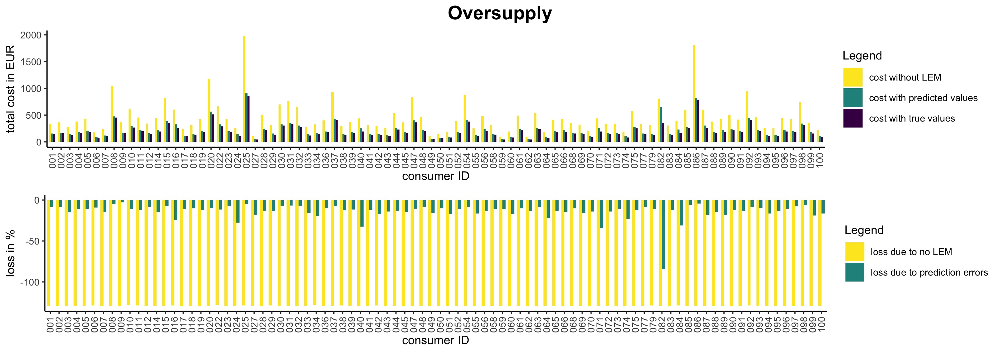

[](http://quantlet.de/)

## [](http://quantlet.de/) **BLEMevaluateMarketSim** [](http://quantlet.de/)

```yaml

Name of Quantlet: BLEMevaluateMarketSim

Published in: 'Forecasting in blockchain-based smart grids: Testing a prerequisite for the implementation of local energy markets'

Description: Generates plots and tables to evaluate the outcomes of three market simulations of a blind double auction as implemented in a smart contract by Mengelkamp et al. (2018) with and without predictions of energy consumption values.

Keywords: blind double auction, market mechanism, balanced supply, oversupply, undersupply, predicted energy consumption values, true energy consumption values, barplot, equilibrium price, local energy market, loss, prediction error, percentage savings, percentage loss

Author: Michael Kostmann

See also:
- BLEMdataGlimpse
- BLEMdescStatEnergyData
- BLEMevaluateEnergyPreds
- BLEMmarketSimulation
- BLEMplotEnergyData
- BLEMplotEnergyPreds
- BLEMplotPredErrors
- BLEMpredictLASSO
- BLEMpredictLSTM
- BLEMpredictNaive
- BLEMtuneLSTM
- BLEMplotScalingForLSTM

Submitted:  26.10.2018

Input:
- data: 100 consumer and 100 prosumer data sets containing electricity readings in 3-minute intervals (csv-files)
- predictions: 15-minute interval prediction of electricity consumption for every consumer forecasted with LASSO model (csv-file)
- market outcomes: market simulations with true and predicted electricity consumption values in three different supply scenarios (balanced, over-, and undersupply) (RData-files)

Output:
- barplots showing savings due to participation in local energy market and loss due to prediction errors in local energy market in three different supply scenarios
- tables (as csv-files for latex) summarising savings due to participation in local energy market and loss due to prediction errors in local energy market in three different supply scenarios

```





### R Code
```r


## Analysis of market simulation
## Author: Michael Kostmann


# Load packages
packages  = c("cowplot")
invisible(lapply(packages, library, character.only = TRUE))

# Source user-defined functions
functions = c("FUN_getTargets.R",
              "FUN_settlePredErrors.R")
invisible(lapply(functions, source))

# Function for easy string pasting
"%&%"     = function(x, y) {paste(x, y, sep = "")}

# Specify which datasets from directories should be loaded for market analysis
files_c = substring(list.files("../data/consumer/",
                                pattern = "*.csv"),
                     1, 17)[-c(13, 21, 26, 35, 46, 53, 57, 67, 76, 78, 80, 81)]

# Load consumption data per 15-minute time interval
cons_true = matrix(NA, nrow = 8836, ncol = (length(files_c)))
i = 0

for(id in files_c) {
    i = i+1
    cons_true[, i] = getTargets(path    = "../data/consumer/",
                                 id     = id,
                                 return = "consumption",
                                 min    = "2017-10-01 00:00",
                                 max    = "2018-01-01 00:00")
}


# Define vector of datasets to exclude from error analysis
remove        = c(13, 21, 34, 45, 52, 56, 66, 75, 77, 79, 81)

# Load predicted consumption values
cons_pred_all = read.csv("predictions/LASSO_predictions.csv")[, -1]
cons_pred     = cons_pred_all[, -remove]

# Set vector with supply scenarios
scenarios = c("_balanced", "_oversupply", "_undersupply")
captions  = c("Balanced supply", "Oversupply", "Undersupply")

# Initate table with average market outcome indicators
eval_table = data.frame("X1" = c("Equilibrium price (in EURct)",
                                 "LEM price (in EURct)",
                                 "Revenue (in EUR)",
                                 "Cost with LEM (in EUR)",
                                 "Cost without LEM (in EUR)"))

loss_table = data.frame("X1" = c("Cost without LEM (in EUR)",
                                 "Cost predicted values (in EUR)",
                                 "Cost true values (in EUR)",
                                 "Savings due to LEM (in %)",
                                 "Loss due to pred. errors (in %)"))

# Initate column counters for tables
col1 = 1
col2 = 1

# Loop over scenarios
for(s in scenarios){
    
    # Load market outcomes
    load("market_outcomes/true_outcomes"%&%s%&%".RData")
    load("market_outcomes/pred_outcomes"%&%s%&%".RData")
    
    
    ## TRUE CONSUMPTION VALUES ##
    
    # Extract supply, demand, and equilibrium prices per period
    supply_true    = map_dbl(market_outcomes_true, "supply")
    demand_true    = map_dbl(market_outcomes_true, "demand")
    eq_price_true  = map_dbl(market_outcomes_true, "eq_price")
    LEM_price_true = map_dbl(market_outcomes_true, "LEM_price")
    
    # Calculate average prices
    mean(eq_price_true)
    median(eq_price_true)
    
    # Cost per time slot per consumer (in EUR)
    cost_cons_true = do.call(rbind, map(market_outcomes_true,
                                    .f = function(x) {
                                        x$bid_results[, "cost"]
                                    })) / 100
    
    # Total cost to consumers per time slot
    cost_per_slot_true = rowSums(cost_cons_true)
    
    # Total cost per consumer over whole simulation period
    cost_per_cons_true = colSums(cost_cons_true)
    
    # Revenue per time slot per producer (in EUR)
    revenue_prod_true = do.call(rbind, map(market_outcomes_true,
                                         .f = function(x) {
                                             x$asks_results[, "revenue"]
                                         })) / 100
    
    # Total revenue for producer per time slot
    revenue_per_slot_true = rowSums(revenue_prod_true)
    
    # Total revenue per producer over whole simulation period
    revenue_per_pros_true = colSums(revenue_prod_true)


    ## PREDICTED CONSUMPTION VALUES ##
    
    # Extract supply, demand, and equilibrium prices per period
    supply_pred    = map_dbl(market_outcomes_pred, "supply")
    demand_pred    = map_dbl(market_outcomes_pred, "demand")
    eq_price_pred  = map_dbl(market_outcomes_pred, "eq_price")
    LEM_price_pred = map_dbl(market_outcomes_pred, "LEM_price")
    
    # Calculate average prices
    mean(eq_price_pred)
    median(eq_price_pred)

    # Cost per time slot per consumer (in EUR)
    cost_cons_pred = do.call(rbind, map(market_outcomes_pred,
                                         .f = function(x) {
                                             x$bid_results[, "cost"]
                                         })) / 100
    
    # Total cost to consumers per time slot
    cost_per_slot_pred = rowSums(cost_cons_pred)
    
    # Total cost per consumer over whole simulation period
    cost_per_cons_pred = colSums(cost_cons_pred)
    
    # Revenue per time slot per producer (in EUR)
    revenue_prod_pred = do.call(rbind, map(market_outcomes_pred,
                                            .f = function(x) {
                                                x$asks_results[, "revenue"]
                                            })) / 100
    
    # Total revenue for producer per time slot
    revenue_per_slot_pred = rowSums(revenue_prod_pred)
    
    # Total revenue per producer over whole simulation period
    revenue_per_pros_pred = colSums(revenue_prod_pred)
    
    
    ## COST DUE TO PREDICTION ERRORS ##

    
    # Compute settlement costs for prediction errors
    cost_correction = settlePredErrors((cons_pred-cons_true),
                                        min_price = 12.31,
                                        max_price = 28.69) / 100
    
    # Adjust cost per consumer per time slot
    cost_per_slot_adjusted = cost_cons_pred - cost_correction
    
    # Total adjusted cost per consumer over whole simulation period
    cost_per_cons_pred_adjusted = colSums(cost_per_slot_adjusted)
    
    # Loss per consumer due to prediction error
    cost_per_cons_pred_adjusted-cost_per_cons_true
    100*(cost_per_cons_pred_adjusted-cost_per_cons_true)/cost_per_cons_true
    
    # Cost without LEM
    cost_wo_LEM_true = colSums(cons_true) * 28.69 / 100
    cost_wo_LEM_pred = colSums(cons_pred) * 28.69 / 100
    
    # Loss per consumer due to no LEM
    cost_wo_LEM_true - cost_per_cons_true
    100*(cost_wo_LEM_true - cost_per_cons_true)/cost_per_cons_true
    
    
    ## PLOT RESULTS ##
    
    # Bind data for barplots
    cost_data = data.frame("ID"             = substring(files_c, 15, 17),
                            "cost_noLEM"    = cost_wo_LEM_true,
                            "cost_adjusted" = cost_per_cons_pred_adjusted,
                            "cost_true"     = cost_per_cons_true)
    
    loss_data = data.frame("ID"          = substring(files_c, 15, 17),
                            "loss_noLEM" = 
                               100*(cost_per_cons_true - cost_wo_LEM_true) /
                                cost_per_cons_true,
                            "loss_pred"  =
                               100*(cost_per_cons_true - 
                                        cost_per_cons_pred_adjusted) /
                                cost_per_cons_true)
    
    #Reshape data to long-format
    cost_data_long = melt(cost_data, id.vars = "ID")
    loss_data_long = melt(loss_data, id.vars = "ID")
    
    # Plot barplots with total costs
    ptitle = ggdraw() + 
        draw_label(captions[col2],
                   size = 16,
                   fontface = "bold")
    
    p = ggplot(cost_data_long,
               aes(x    = ID,
                   y    = value,
                   fill = variable)) +
        geom_bar(stat     = "identity",
                 width    = 0.7,
                 position = "dodge") +
        scale_fill_viridis_d(labels = c("cost without LEM",
                                        "cost with predicted values    ",
                                        "cost with true values"),
                             end    = 0,
                             begin  = 1) +
        theme_classic(base_size = 10) +
        theme(axis.text.x = element_text(angle = 90,
                                         vjust = 0.5,
                                         size  = 8)) +
        labs(x    = "consumer ID",
             y    = "total cost in EUR",
             fill = "Legend")
    
    p1 = ggplot(loss_data_long,
                aes(x    = ID,
                    y    = value,
                    fill = variable)) +
        geom_bar(stat     = "identity",
                 width    = 0.7,
                 position = "dodge") +
        scale_fill_viridis_d(labels = c("loss due to no LEM",
                                        "loss due to prediction errors"),
                             end    = 0.5,
                             begin  = 1) +
        theme_classic(base_size = 10) +
        theme(axis.text.x = element_text(angle = 90,
                                         vjust = 0.5,
                                         size  = 8)) +
        labs(x    = "consumer ID",
             y    = "loss in %",
             fill = "Legend")
    
    plot_grid(ptitle, p, p1, ncol = 1, rel_heights = c(0.15, 1, 1))
    ggsave("totalenergycost"%&%s%&%".jpg",
           height = 8.267/2, width = 11.692)
    
    
    ## Generate TABLES ##
    
    # Table comparing market outcomes with true and predicted values
    col1 = col1 + 1
    eval_table[, col1] = c(mean(eq_price_true),
                            mean(LEM_price_true),
                            mean(revenue_per_pros_true),
                            mean(cost_per_cons_true),
                            mean(cost_wo_LEM_true))
    
    col1 = col1 + 1
    eval_table[, col1] = c(mean(eq_price_pred),
                            mean(LEM_price_pred),
                            mean(revenue_per_pros_pred),
                            mean(cost_per_cons_pred_adjusted),
                            mean(cost_wo_LEM_pred))
    
    # Table showing loss due to prediction errors
    col2 = col2 + 1
    loss_table[, col2] = c(mean(cost_wo_LEM_true),
                           mean(cost_per_cons_pred_adjusted),
                           mean(cost_per_cons_true),
                           mean(100*(cost_wo_LEM_true -
                                         cost_per_cons_true) /
                                    cost_per_cons_true),
                           mean(100*(cost_per_cons_true -
                                         cost_per_cons_pred_adjusted) /
                                    cost_per_cons_true))
    
}

# Write table to csv-file
write.csv(eval_table, "tables/average_outcomes.csv")
write.csv(loss_table, "tables/loss_outcomes.csv")


## end of file ##

```

automatically created on 2018-10-26