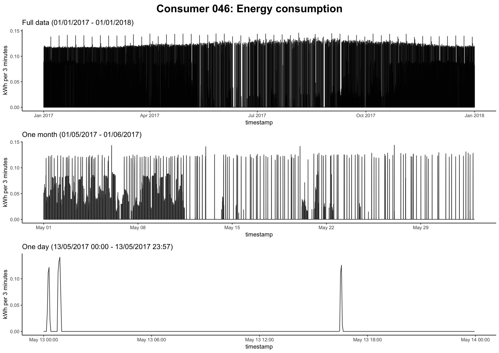
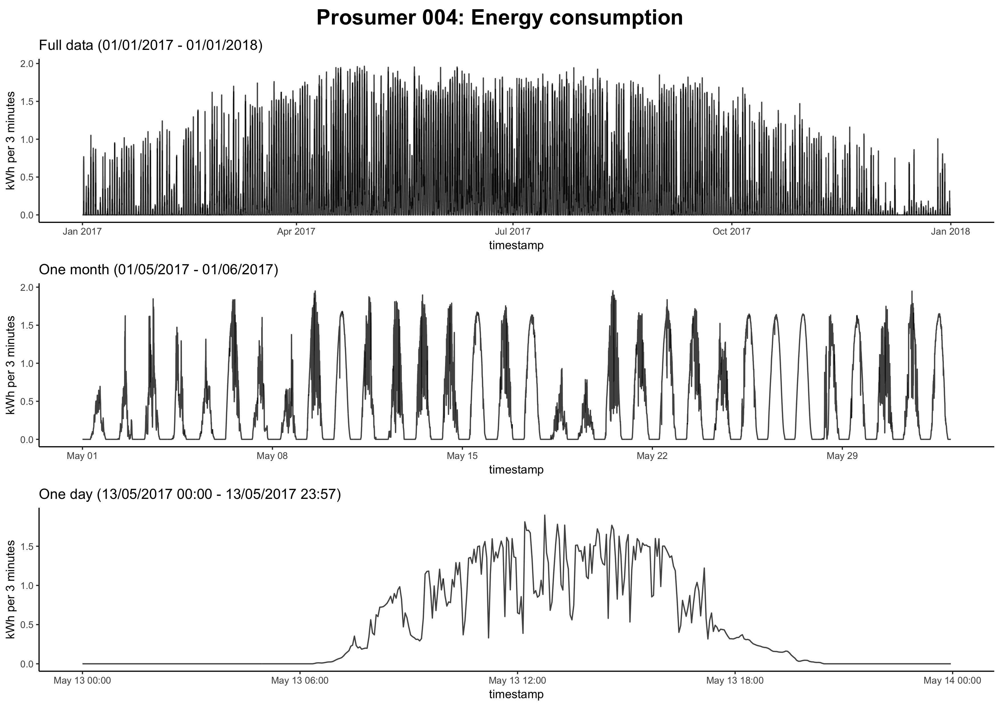
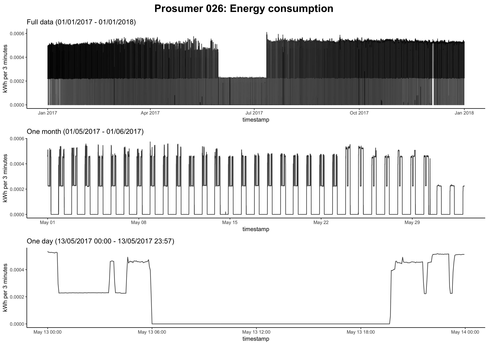
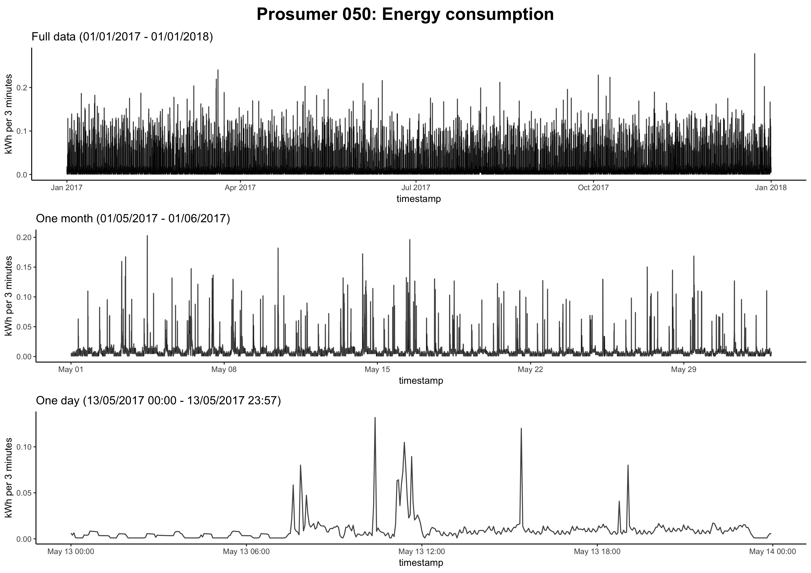

[](http://quantlet.de/)

## [](http://quantlet.de/) **BLEMplotEnergyData** [](http://quantlet.de/)

```yaml


Name of Quantlet: BLEMplotEnergyData

Published in: Forecasting in blockchain-based smart grids: Testing a prerequisite for the implementation of local energy markets

Description: Generates plots of energy consumption/production/both time series of energy consumers/prosumers generated from energy readings in 3-minute intervals.

Keywords: energy consumption, energy production, consumer, prosumer, local energy trading, time series graph, energy readings, household, plot

Author: Michael Kostmann

See also:
- BLEMdataGlimpse
- BLEMdescStatEnergyData
- BLEMevaluateEnergyPreds
- BLEMevaluateMarketSim
- BLEMmarketSimulation
- BLEMplotEnergyPreds
- BLEMplotPredErrors
- BLEMpredictLASSO
- BLEMpredictLSTM
- BLEMpredictNaive
- BLEMtuneLSTM
- BLEMplotScalingForLSTM

Submitted:  26.10.2018

Input: 100 consumer and 100 prosumer data sets containing electricity readings in 3-minute intervals (csv-files)

Output: time series graphs of electricity consumption, production or both of specified consumers/prosumers in different adjustable time periods
```














### R Code
```r


## Plot time series recorded by energy smart meters
## Author: Michael Kostmann


# Set options
options(scipen = 999)

# Load packages
packages  = c("data.table",
              "tidyverse",
              "tidyquant",
              "cowplot",
              "tibbletime")
invisible(lapply(packages, library, character.only = TRUE))

# Load user-defined functions
functions = c("FUN_getData.R")
invisible(lapply(functions, source))

# Function for easy string pasting
"%&%"     = function(x, y) {paste(x, y, sep = "")}


### PLOT ONLY CONSUMPTION VALUES ###

# Specify consumer or prosumer directory
path = "../data/consumer/"
#path = "../data/prosumer/"

# Load data with consumption or production values
data = getData(path,
               data   = "all",
               return = "consumption")
# data = getData(path,
#                data   = "all",
#                return = "production")

# Specify which datasets should be plotted (different options possible,
# options can be adjusted as required):


# a) Plot all consumers
# datasets = colnames(data)[-1]

# b) Plot exemplary consumption time series (5 with large 0 shares + 2 normal)
datasets = c("c013_cons", "c035_cons", "c067_cons", "c070_cons",
              "c076_cons", "c082_cons", "c015_cons", "c090_cons")

# c) Plot consumers with abnormal consumption patterns
# datasets = c("c021_cons", "c046_cons", "c053_cons", "c057_cons",
#              "c067_cons", "c078_cons", "c080_cons")

# d) Plot consumption values of all prosumers with positive total production
# datasets = c("p012_cons", "p015_cons", "p019_cons", "p024_cons", "p026_cons",
#              "p030_cons", "p031_cons", "p072_cons", "p075_cons", "p083_cons",
#              "p084_cons", "p085_cons", "p086_cons", "p089_cons")

# e) Plot consumption values of additional prosumers discussed in thesis
# datasets = c("p004_cons", "p038_cons", "p050_cons", "p061_cons", "p093_cons")

# Specify file format to save plot (.jpg or .pdf)
format <- ".jpg"

# Loop over specified datasets plot and save plots
for(id in datasets) {
    
    p_title1 <- ggdraw() + 
        draw_label("Consumer "%&%substr(id, 2, 4)%&%": Energy consumption",
                   size     = 18,
                   fontface = "bold")
    
    p1 <- data[, c("time", eval(id))] %>%
        rename(value := !!(id)) %>%
        select(time, value) %>%
        
        ggplot(aes(time, value)) +
        geom_line(alpha = 0.75) +
        theme_classic(base_size = 10) +
        ylab("kWh per 3 minutes") +
        xlab("timestamp") +
        labs(title = "Full data (01/01/2017 - 01/01/2018)")
    
    p2 <- data[, c("time", eval(id))] %>%
        rename(value := !!(id)) %>%
        select(time, value) %>%
        filter_time("2017-05-01" ~ "2017-06-01") %>%
        
        ggplot(aes(time, value)) +
        geom_line(alpha = 0.75) +
        theme_classic(base_size = 10) +
        ylab("kWh per 3 minutes") +
        xlab("timestamp") +
        labs(title = "One month (01/05/2017 - 01/06/2017)")
    
    p3 <- data[, c("time", eval(id))] %>%
        rename(value := !!(id)) %>%
        select(time, value) %>%
        filter_time("2017-05-13 00:00:00" ~ "2017-05-13 23:57:00") %>%
        
        ggplot(aes(time, value)) +
        geom_line(alpha = 0.75) +
        theme_classic(base_size = 10) +
        ylab("kWh per 3 minutes") +
        xlab("timestamp") +
        labs(title = "One day (13/05/2017 00:00 - 13/05/2017 23:57)")
    
    plot_grid(p_title1, p1, p2, p3, ncol = 1, rel_heights = c(0.15, 1, 1, 1))
    ggsave(""%&%id%&%format, height = 8.267, width = 11.692)
    
}


### PLOT CONSUMPTION AND PRODUCTION VALUES IN ONE GRAPH ###

# Specify consumer or prosumer directory
path = "../data/prosumer/"

# Load data with consumption or production values
data_cons = getData(path, data = "all", return = "consumption")
data_prod = getData(path, data = "all", return = "production")

# Specify which datasets should be plotted (adjust as required):
datasets_cp = c("p012_prod", "p015_prod", "p019_prod", "p024_prod", "p026_prod",
                "p030_prod", "p031_prod", "p072_prod", "p075_prod", "p083_prod",
                "p084_prod", "p085_prod", "p086_prod", "p089_prod")

# Specify file format to save plot (.jpg or .pdf)
format <- ".jpg"

# Loop over specified datasets plot and save plots
for(id in datasets_cp) {
    p_title4 <- ggdraw() + 
        draw_label("Prosumer "%&%substr(id, 2, 4)%&%
                   ": Net energy production and consumption",
                   size     = 18,
                   fontface = "bold")
    
    p5 <- data_prod[, c("time", eval(id))] %>%
        rename(prod := !!(id)) %>%
        select(time, prod) %>%
        
        ggplot(aes(x      = time,
                   y      = prod,
                   colour = "net production")) +
        geom_line(alpha = 0.75) +
        geom_line(data = data_cons,
                  aes_string("time",
                             eval(gsub("prod", "cons", eval(id))),
                             color = '"net consumption"')) +
        scale_colour_manual("",
                            breaks = c("net production", "net consumption"),
                            values = c("darkblue", "red")) +
        theme_classic(base_size = 10) +
        ylab("kWh per 3 minutes") +
        xlab("timestamp") +
        labs(title = "Full data (01/01/2017 - 01/01/2018)")
    
    p6 <- data_prod[, c("time", eval(id))] %>%
        rename(prod := !!(id)) %>%
        select(time, prod) %>%
        filter_time("2017-05-01" ~ "2017-06-01") %>%
        
        ggplot(aes(x      = time,
                   y      = prod,
                   colour = "net production")) +
        geom_line(alpha = 0.75) +
        geom_line(data = data_cons %>%
                      filter_time("2017-05-01" ~ "2017-06-01"),
                  aes_string("time",
                             eval(gsub("prod", "cons", eval(id))),
                             color = '"net consumption"')) +
        scale_colour_manual("",
                            breaks = c("net production", "net consumption"),
                            values = c("darkblue", "red")) +
        theme_classic(base_size = 10) +
        ylab("kWh per 3 minutes") +
        xlab("timestamp") +
        labs(title = "One month (01/05/2017 - 01/06/2017)")
    
    p7 <- data_prod[, c("time", eval(id))] %>%
        rename(prod := !!(id)) %>%
        select(time, prod) %>%
        filter_time("2017-05-13 00:00:00" ~ "2017-05-13 23:57:00") %>%
        
        ggplot(aes(x      = time,
                   y      = prod,
                   colour = "net production")) +
        geom_line(alpha = 0.75) +
        geom_line(data = data_cons %>% 
                      filter_time("2017-05-13 00:00:00" ~ "2017-05-13 23:57:00") ,
                  aes_string("time",
                             eval(gsub("prod", "cons", eval(id))),
                             colour = '"net consumption"')) +
        scale_colour_manual("",
                            breaks = c("net production", "net consumption"),
                            values = c("darkblue", "red")) +
        theme_classic(base_size = 10) +
        ylab("kWh per 3 minutes") +
        xlab("timestamp") +
        labs(title = "One day (13/05/2017 00:00 - 13/05/2017 23:57)")
    
    plot_grid(p_title4, p5, p6, p7, ncol = 1, rel_heights = c(0.15, 1, 1, 1))
    ggsave(""%&%id%&%"&cons"%&%format, height = 8.267, width = 11.692)
}


## end of file ##

```

automatically created on 2018-10-26