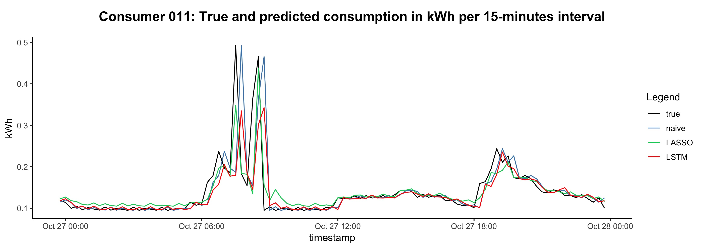
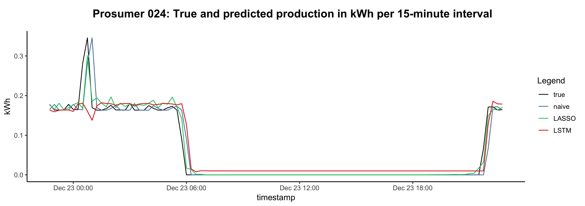

[](http://quantlet.de/)

## [](http://quantlet.de/) **BLEMplotEnergyPreds** [](http://quantlet.de/)

```yaml


Name of Quantlet: BLEMplotEnergyPreds

Published in: Forecasting in blockchain-based smart grids: Testing a prerequisite for the implementation of local energy markets

Description: Exemplary plots true and forecasted values predicted with LSTM, LASSO, and persistence models for 24 hours.

Keywords: household energy prediction, energy consumption, energy production, forecast, LSTM, LASSO, persistence model, benchmark, plot, glimpse, regression model, machine learning

Author: Michael Kostmann

See also:
- BLEMdataGlimpse
- BLEMdescStatEnergyData
- BLEMevaluateEnergyPreds
- BLEMevaluateMarketSim
- BLEMmarketSimulation
- BLEMplotEnergyData
- BLEMplotPredErrors
- BLEMpredictLASSO
- BLEMpredictLSTM
- BLEMpredictNaive
- BLEMtuneLSTM
- BLEMplotScalingForLSTM

Submitted:  26.10.2018

Datafile: for your data sets - delete if not used

Input:
- data: exemplary one consumer and one prosumer data set containing energy consumption and production readings in 3-minute intervals (csv-files)
- predictions: 15-minute interval prediction of electricity consumption and energy production forecasted with LASSO, LSTM, and persistence model (csv-files)

Output: line graphs showing true and predicted consumption/production values
```





### R Code
```r


## Plot true and predicted consumption values in testing period
## Author: Michael Kostmann


# Load user-defined functions
packages  = c("cowplot")
invisible(lapply(packages, library, character.only = TRUE))

# Load user-defined functions
functions = c("FUN_getTargets.R")
invisible(lapply(functions, source))

# Load prediction dataset
predictions_LSTM_all  =
    read.csv("predictions/consumer/LSTM_predictions.csv")[, -1]
predictions_LASSO_all =
    read.csv("predictions/consumer/LASSO_predictions.csv")[, -1]
predictions_naive_all =
    read.csv("predictions/consumer/naive_predictions.csv")[, -1]

# Set length of plotted time series
n = min(nrow(predictions_LSTM_all),
         nrow(predictions_LASSO_all),
         nrow(predictions_naive_all))


## Plot exemplary day of one dataset ##

###  CONSUMER  ###

# Select according column of prediction datasets
predictions_LSTM  = predictions_LSTM_all[, 11]
predictions_LASSO = predictions_LASSO_all[, 11]
predictions_naive = predictions_naive_all[, 11]

# Get true values
targets = getTargets(path    = "../data/consumer/",
                      id     = "consumer-00000011",
                      return = "consumption",
                      min    = "2017-10-01 00:03",
                      max    = "2018-01-01 00:00")[1:n]

# Bind timeseries to one dataframe
data = data.frame("time"   = seq.POSIXt(as.POSIXct("2017-10-01 00:00"),
                                        as.POSIXct("2018-01-01 00:00"),
                                        by = 900)[1:n],
                   "true"  = targets[1:n],
                   "naive" = predictions_naive[1:n],
                   "LASSO" = predictions_LASSO[1:n],
                   "LSTM"  = predictions_LSTM[1:n])

# Reshape data to long-format
data_long = melt(data[(26*24*4):(27*24*4), ], id.vars = "time")

# Plot

p_title = ggdraw() + 
    draw_label(paste0("Consumer 011: True and predicted consumption",
                      " in kWh per 15-minute interval"),
               size = 16,
               fontface = "bold")

p       = data_long %>%
    ggplot(aes(x = time, y = value, by = variable)) +
    geom_line(aes(color = variable)) +
    theme_classic(base_size = 12) +
    labs(color = "Legend") +
    scale_color_manual(values=c("black", "steelblue", "springgreen3", "red")) +
    ylab("kWh")+
    xlab("timestamp")

plot_grid(p_title, p, ncol = 1, rel_heights = c(0.15, 1))
ggsave("c011_pred_cons.jpg", height = (8.267/2), width = 11.692)


###  PROSUMER  ###


# Load prediction dataset
predictions_LSTM_all  =
    read.csv("predictions/prosumer/LSTM_predictions.csv")[, -1]
predictions_LASSO_all =
    read.csv("predictions/prosumer/LASSO_predictions.csv")[, -1]
predictions_naive_all =
    read.csv("predictions/prosumer/naive_predictions.csv")[, -1]


# Select according column of prediction datasets
predictions_LSTM  = predictions_LSTM_all[, 2]
predictions_LASSO = predictions_LASSO_all[, 2]
predictions_naive = predictions_naive_all[, 2]

# Get true values
targets = getTargets(path    = "../data/prosumer/",
                      id     = "producer-00000024",
                      return = "production",
                      min    = "2017-10-01 00:03",
                      max    = "2018-01-01 00:00")[1:n]

# Bind timeseries to one dataframe
data = data.frame("time"   = seq.POSIXt(as.POSIXct("2017-10-01 00:00"),
                                        as.POSIXct("2018-01-01 00:00"),
                                        by = 900)[1:n],
                   "true"  = targets[1:n],
                   "naive" = predictions_naive[1:n],
                   "LASSO" = predictions_LASSO[1:n],
                   "LSTM"  = predictions_LSTM[1:n])

# Reshape data to long-format
data_long = melt(data[(83*24*4):(84*24*4), ], id.vars = "time")

# Plot

p_title = ggdraw() + 
    draw_label(paste0("Prosumer 024: True and predicted production", 
                      " in kWh per 15-minute interval"),
               size = 16,
               fontface = "bold")

p = data_long %>%
    ggplot(aes(x = time, y = value, by = variable)) +
    geom_line(aes(color = variable)) +
    theme_classic(base_size = 12) +
    labs(color = "Legend") +
    scale_color_manual(values=c("black", "steelblue", "springgreen3", "red")) +
    ylab("kWh")+
    xlab("timestamp")

plot_grid(p_title, p, ncol = 1, rel_heights = c(0.15, 1))
ggsave("p024_pred_prod.jpg", height = (8.267/2), width = 11.692)


## end of file ##

```

automatically created on 2018-10-25