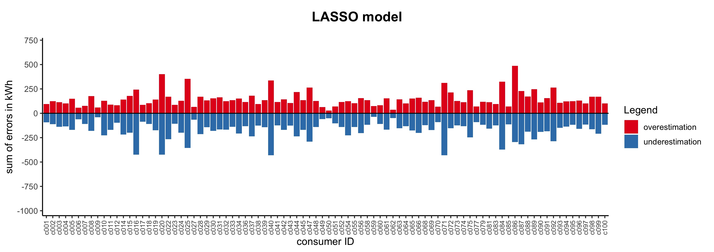
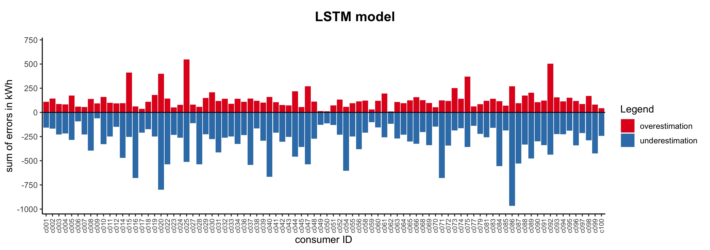
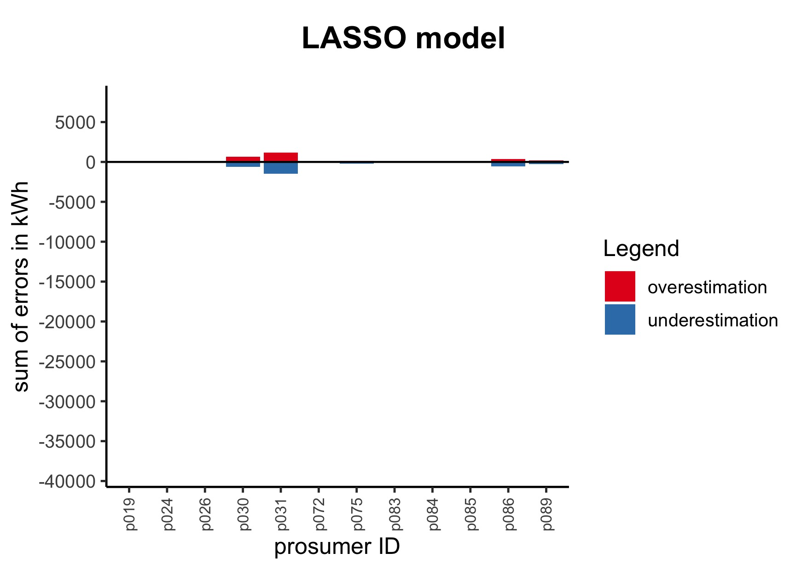
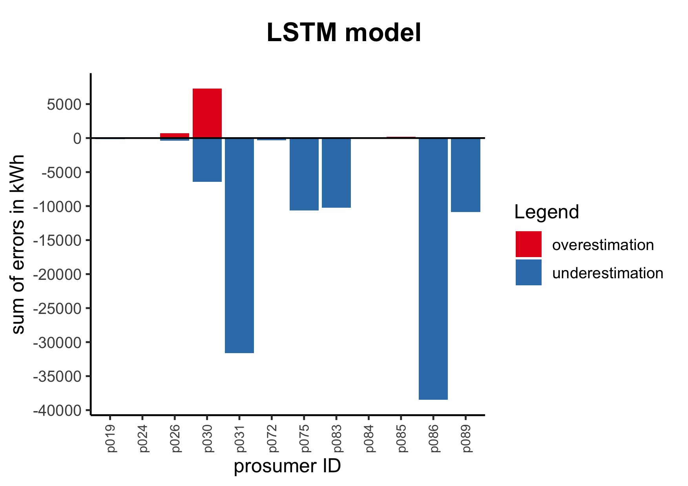
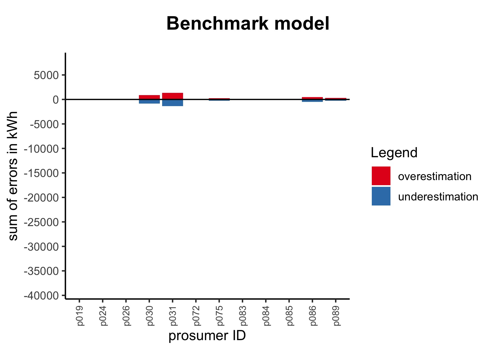

[](http://quantlet.de/)

## [](http://quantlet.de/) **BLEMplotPredErrors** [](http://quantlet.de/)

```yaml


Name of Quantlet: BLEMplotPredErrors

Published in: Forecasting in blockchain-based smart grids: Testing a prerequisite for the implementation of local energy markets

Description: Generates plots of total over-/underestimation errors of naive, LASSO, and LSTM models for multiple energy consumer and prosumer data sets.

Keywords: household energy prediction, machine learning, prediction errors, barplot, LSTM neural network, LASSO regression, naive predictor, persistence model, energy consumer, energy prosumer

Author: Michael Kostmann

See also:
- BLEMdataGlimpse
- BLEMdescStatEnergyData
- BLEMevaluateEnergyPreds
- BLEMevaluateMarketSim
- BLEMmarketSimulation
- BLEMplotEnergyData
- BLEMplotEnergyPreds
- BLEMpredictLASSO
- BLEMpredictLSTM
- BLEMpredictNaive
- BLEMtuneLSTM
- BLEMplotScalingForLSTM

Submitted:  26.10.2018

Input:
- data: 100 consumer and 100 prosumer data sets containing electricity readings in 3-minute intervals (csv-files)
- predictions: 15-minute interval prediction of electricity consumption for every consumer and of electricity production for prosumer forecasted with LASSO, LSTM, and persistence model (csv-files)

Output: barplots for each forecasting model (LASSO, LSTM, persistence) depicting total over- and underestimation errors for 88 consumer data sets and 12 prosumer data sets
```












### R Code
```r


## Plot over-/underestimation for each dataset
## Author: Michael Kostmann


# Load packages
packages  = c("cowplot",
              "tidyverse")
invisible(lapply(packages, library, character.only = TRUE))

# Load user-defined functions
functions = c("FUN_getTargets.R",
              "FUN_getData.R")
invisible(lapply(functions, source))


## CONSUMER ##


# Define vector of datasets to exclude from error analysis
remove   = c(13, 21, 34, 45, 52, 56, 66, 75, 77, 79, 81)

# Load prediction dataset
predictions_c_LSTM_all  =
    read.csv("predictions/consumer/LSTM_predictions.csv")[, -1]
predictions_c_LASSO_all =
    read.csv("predictions/consumer/LASSO_predictions.csv")[, -1]
predictions_c_naive_all =
    read.csv("predictions/consumer/naive_predictions.csv")[, -1]

# Aggregate data to 15-min intervals and strip timestamps to get true values
targets = getData(path   = "../data/consumer/",
                  data   = "all",
                  return = "consumption") %>%
    filter_time("2017-10-01 00:03:00" ~ "2018-01-01 00:00:00") %>%
    mutate(time_aggr =
               collapse_index(index      = time,
                              period     = "15 minutely",
                              side       = "end",
                              start_date = as_datetime(min(time),
                                                       tz = "CET"))) %>%
    select(-time) %>%
    group_by(time_aggr) %>%
    summarise_all(sum) %>%
    select(-time_aggr)

# Set length of plotted time series
n = min(nrow(predictions_c_LSTM_all),
         nrow(predictions_c_LASSO_all),
         nrow(predictions_c_naive_all),
         nrow(targets))

# Create index vector for x-Axis labels
id = gsub(".*?([0]{5})([0-9]{3}).*", "c\\2",
                list.files(path = "../data/consumer/",
                           pattern = "*.csv"))[-26]

# Compute errors
errors_c_LSTM  = predictions_c_LSTM_all[1:n, -remove] - targets[1:n, -remove]
errors_c_LASSO = predictions_c_LASSO_all[1:n, -remove] - targets[1:n, -remove]
errors_c_naive = predictions_c_naive_all[1:n, -remove] - targets[1:n, -remove]

# Compute sum of over-/underestimation erros
pos_c_LSTM  = apply(errors_c_LSTM, 2,
                    FUN = function(x) {sum(x[x >= 0], na.rm = TRUE)})
neg_c_LSTM  = apply(errors_c_LSTM, 2,
                    FUN = function(x) {sum(x[x <= 0], na.rm = TRUE)})

pos_c_LASSO = apply(errors_c_LASSO, 2,
                    FUN = function(x) {sum(x[x >= 0], na.rm = TRUE)})
neg_c_LASSO = apply(errors_c_LASSO, 2,
                    FUN = function(x) {sum(x[x <= 0], na.rm = TRUE)})

pos_c_naive = apply(errors_c_naive, 2,
                    FUN = function(x) {sum(x[x >= 0], na.rm = TRUE)})
neg_c_naive = apply(errors_c_naive, 2,
                    FUN = function(x) {sum(x[x <= 0], na.rm = TRUE)})

# Bind vectors to dataframe
data_c_LSTM  = data.frame("ID"               = id[-remove],
                           "overestimation"  = pos_c_LSTM,
                           "underestimation" = neg_c_LSTM)

data_c_LASSO = data.frame("ID"               = id[-remove],
                           "overestimation"  = pos_c_LASSO,
                           "underestimation" = neg_c_LASSO)

data_c_naive = data.frame("ID"               = id[-remove],
                           "overestimation"  = pos_c_naive,
                           "underestimation" = neg_c_naive)

# Reshape data into long-format
long_c_LSTM  = melt(data_c_LSTM, id.vars = "ID")
long_c_LASSO = melt(data_c_LASSO, id.vars = "ID")
long_c_naive = melt(data_c_naive, id.vars = "ID")

# Plot

# LSTM
p_title = ggdraw() + 
    draw_label("LSTM model",
               size     = 16,
               fontface = "bold")

p = long_c_LSTM %>%
    ggplot() +
    geom_bar(data = subset(long_c_LSTM,
                           variable == "overestimation"),
             aes(x    = ID,
                 y    = value,
                 fill = variable),
             stat = "identity") +
    
    geom_bar(data = subset(long_c_LSTM,
                           variable  == "underestimation"),
             aes(x    = ID,
                 y    = value,
                 fill = variable),
             stat = "identity") + 
    
    geom_hline(yintercept = 0,
               color      = "black") +
    
    scale_y_continuous(limits = c(min(c(neg_c_LASSO,
                                        neg_c_LSTM,
                                        neg_c_naive)),
                                  max(c(pos_c_LASSO,
                                        pos_c_LSTM,
                                        pos_c_naive))),
                       breaks = seq(-1750, 750, by = 250)) +
    scale_fill_brewer(palette = "Set1") +
    theme_classic(base_size = 12) +
    theme(axis.text.x = element_text(angle = 90,
                                     vjust = 0.5,
                                     size  = 8)) +
    labs(x    = "consumer ID",
         y    = "sum of errors in kWh",
         fill = "Legend")

plot_grid(p_title, p, ncol = 1, rel_heights = c(0.15, 1))
ggsave("c_barplot_LSTM_overunderestimation.jpg",
       height = (8.267/2), width = 11.692)

# LASSO
p_title1 = ggdraw() + 
    draw_label("LASSO model",
               size     = 16,
               fontface = "bold")

p1 = long_c_LASSO %>%
    ggplot() +
    geom_bar(data = subset(long_c_LASSO,
                           variable == "overestimation"),
             aes(x    = ID,
                 y    = value,
                 fill = variable),
             stat = "identity") +
    
    geom_bar(data = subset(long_c_LASSO,
                           variable  == "underestimation"),
             aes(x    = ID,
                 y    = value,
                 fill = variable),
             stat = "identity") +
    
    geom_hline(yintercept = 0,
               color      = "black") +
    
    scale_y_continuous(limits = c(min(c(neg_c_LASSO,
                                        neg_c_LSTM,
                                        neg_c_naive)),
                                  max(c(pos_c_LASSO,
                                        pos_c_LSTM,
                                        pos_c_naive))),
                       breaks = seq(-1750, 750, by = 250)) +
    scale_fill_brewer(palette = "Set1") + 
    theme_classic(base_size = 12) +
    theme(axis.text.x = element_text(angle = 90,
                                     vjust = 0.5,
                                     size  = 8)) +
    labs(x    = "consumer ID",
         y    = "sum of errors in kWh",
         fill = "Legend")

plot_grid(p_title1, p1, ncol = 1, rel_heights = c(0.15, 1))
ggsave("c_barplot_LASSO_overunderestimation.jpg",
       height = (8.267/2), width = 11.692)

# naive
p_title2 = ggdraw() + 
    draw_label("Benchmark model",
               size     = 16,
               fontface = "bold")

p2 = long_c_naive %>%
    ggplot() +
    geom_bar(data = subset(long_c_naive,
                           variable == "overestimation"),
             aes(x    = ID,
                 y    = value,
                 fill = variable),
             stat = "identity") +
    
    geom_bar(data = subset(long_c_naive,
                           variable  == "underestimation"),
             aes(x    = ID,
                 y    = value,
                 fill = variable),
             stat = "identity") +
    
    geom_hline(yintercept = 0,
               color      = "black") +
    
    scale_y_continuous(limits = c(min(c(neg_c_LASSO,
                                        neg_c_LSTM,
                                        neg_c_naive)),
                                  max(c(pos_c_LASSO,
                                        pos_c_LSTM,
                                        pos_c_naive))),
                       breaks = seq(-1750, 750, by = 250)) +
    scale_fill_brewer(palette = "Set1") + 
    theme_classic(base_size = 12) +
    theme(axis.text.x = element_text(angle = 90,
                                     vjust = 0.5,
                                     size  = 8)) +
    labs(x    = "consumer ID",
         y    = "sum of errors in kWh",
         fill = "Legend")

plot_grid(p_title2, p2, ncol = 1, rel_heights = c(0.15, 1))
ggsave("c_barplot_naive_overunderestimation.jpg",
       height = (8.267/2), width = 11.692)


## PROSUMER ##


# Load prediction dataset
predictions_p_LSTM_all  =
    read.csv("predictions/prosumer/LSTM_predictions.csv")[, -1]
predictions_p_LASSO_all =
    read.csv("predictions/prosumer/LASSO_predictions.csv")[, -1]
predictions_p_naive_all =
    read.csv("predictions/prosumer/naive_predictions.csv")[, -1]

# Aggregate data to 15-min intervals and strip timestamps to get true values
targets = getData(path    = "../data/prosumer/",
                   data   = "all",
                   return = "production") %>%
    filter_time("2017-10-01 00:03:00" ~ "2018-01-01 00:00:00") %>%
    mutate(time_aggr =
               collapse_index(index      = time,
                              period     = "15 minutely",
                              side       = "end",
                              start_date = as_datetime(min(time),
                                                       tz = "CET"))) %>%
    select(-time) %>%
    group_by(time_aggr) %>%
    summarise_all(sum) %>%
    select(-time_aggr)

keep    = c(19, 24, 26, 30, 31, 72, 75,83, 84, 85, 86, 89)

# Set length of plotted time series
n  = min(nrow(predictions_p_LSTM_all),
         nrow(predictions_p_LASSO_all),
         nrow(predictions_p_naive_all),
         nrow(targets))

# Create index vector for x-Axis labels
id = gsub(".*?([0]{5})([0-9]{3}).*", "p\\2",
          list.files(path    = "../data/prosumer/",
                     pattern = "*.csv"))[c(19, 24, 26, 30, 31, 72,
                                           75,83, 84, 85, 86, 89)]

# Compute errors
errors_p_LSTM  = predictions_p_LSTM_all[1:n, ] - targets[1:n, keep]
errors_p_LASSO = predictions_p_LASSO_all[1:n, ] - targets[1:n, keep]
errors_p_naive = predictions_p_naive_all[1:n, ] - targets[1:n, keep]

# Compute sum of over-/underestimation erros
pos_p_LSTM  = apply(errors_p_LSTM, 2,
                    FUN = function(x) {sum(x[x >= 0], na.rm = TRUE)})
neg_p_LSTM  = apply(errors_p_LSTM, 2,
                    FUN = function(x) {sum(x[x <= 0], na.rm = TRUE)})

pos_p_LASSO = apply(errors_p_LASSO, 2,
                    FUN = function(x) {sum(x[x >= 0], na.rm = TRUE)})
neg_p_LASSO = apply(errors_p_LASSO, 2,
                    FUN = function(x) {sum(x[x <= 0], na.rm = TRUE)})

pos_p_naive = apply(errors_p_naive, 2,
                    FUN = function(x) {sum(x[x >= 0], na.rm = TRUE)})
neg_p_naive = apply(errors_p_naive, 2,
                    FUN = function(x) {sum(x[x <= 0], na.rm = TRUE)})

# Bind vectors to dataframe
data_p_LSTM  = data.frame("ID"               = id,
                           "overestimation"  = pos_p_LSTM,
                           "underestimation" = neg_p_LSTM)

data_p_LASSO = data.frame("ID"               = id,
                           "overestimation"  = pos_p_LASSO,
                           "underestimation" = neg_p_LASSO)

data_p_naive = data.frame("ID"               = id,
                           "overestimation"  = pos_p_naive,
                           "underestimation" = neg_p_naive)

# Reshape data into long-format
long_p_LSTM  = melt(data_p_LSTM, id.vars = "ID")
long_p_LASSO = melt(data_p_LASSO, id.vars = "ID")
long_p_naive = melt(data_p_naive, id.vars = "ID")

# Plot

# LSTM
p_title3 = ggdraw() + 
    draw_label("LSTM model",
               size     = 16,
               fontface = "bold")

p3 = long_p_LSTM %>%
    ggplot() +
    geom_bar(data = subset(long_p_LSTM,
                           variable == "overestimation"),
             aes(x    = ID,
                 y    = value,
                 fill = variable),
             stat = "identity") +
    
    geom_bar(data = subset(long_p_LSTM,
                           variable  == "underestimation"),
             aes(x    = ID,
                 y    = value,
                 fill = variable),
             stat = "identity") +
    
    geom_hline(yintercept = 0,
               color      = "black") +
    
    scale_y_continuous(limits = c(min(c(neg_p_LASSO,
                                        neg_p_LSTM,
                                        neg_p_naive)),
                                  max(c(pos_p_LASSO,
                                        pos_p_LSTM,
                                        pos_p_naive))),
                       breaks = seq(-40000, 10000, by = 5000)) +
    
    scale_fill_brewer(palette = "Set1") + 
    theme_classic(base_size = 12) +
    theme(axis.text.x = element_text(angle = 90,
                                     vjust = 0.5,
                                     size  = 8)) +
    labs(x    = "prosumer ID",
         y    = "sum of errors in kWh",
         fill = "Legend")

plot_grid(p_title3, p3, ncol = 1, rel_heights = c(0.15, 1))
ggsave("p_barplot_LSTM_overunderestimation.jpg",
       height = (8.267/2), width = 11.692/2)

# LASSO
p_title4 = ggdraw() + 
    draw_label("LASSO model",
               size     = 16,
               fontface = "bold")

p4 = long_p_LASSO %>%
    ggplot() +
    geom_bar(data = subset(long_p_LASSO,
                           variable == "overestimation"),
             aes(x    = ID,
                 y    = value,
                 fill = variable),
             stat = "identity") +
    
    geom_bar(data = subset(long_p_LASSO,
                           variable  == "underestimation"),
             aes(x    = ID,
                 y    = value,
                 fill = variable),
             stat = "identity") +
    
    geom_hline(yintercept = 0,
               color      = "black") +
    
    scale_y_continuous(limits = c(min(c(neg_p_LASSO,
                                        neg_p_LSTM,
                                        neg_p_naive)),
                                  max(c(pos_p_LASSO,
                                        pos_p_LSTM,
                                        pos_p_naive))),
                       breaks = seq(-40000, 10000, by = 5000)) +

    scale_fill_brewer(palette = "Set1") + 
    theme_classic(base_size = 12) +
    theme(axis.text.x = element_text(angle = 90,
                                     vjust = 0.5,
                                     size  = 8)) +
    labs(x    = "prosumer ID",
         y    = "sum of errors in kWh",
         fill = "Legend")

plot_grid(p_title4, p4, ncol = 1, rel_heights = c(0.15, 1))
ggsave("p_barplot_LASSO_overunderestimation.jpg",
       height = (8.267/2), width = 11.692/2)

# naive
p_title5 = ggdraw() + 
    draw_label("Benchmark model",
               size     = 16,
               fontface = "bold")

p5 = long_p_naive %>% ggplot() +
    geom_bar(data = subset(long_p_naive,
                           variable == "overestimation"),
             aes(x    = ID,
                 y    = value,
                 fill = variable),
             stat = "identity") +
    
    geom_bar(data = subset(long_p_naive,
                           variable  == "underestimation"),
             aes(x    = ID,
                 y    = value,
                 fill = variable),
             stat = "identity") +
    
    geom_hline(yintercept = 0,
               color      = "black") +
    
    scale_y_continuous(limits = c(min(c(neg_p_LASSO,
                                        neg_p_LSTM,
                                        neg_p_naive)),
                                  max(c(pos_p_LASSO,
                                        pos_p_LSTM,
                                        pos_p_naive))),
                       breaks = seq(-40000, 10000, by = 5000)) +
    scale_fill_brewer(palette = "Set1") + 
    theme_classic(base_size = 12) +
    theme(axis.text.x = element_text(angle = 90,
                                     vjust = 0.5,
                                     size  = 8)) +
    labs(x    = "prosumer ID",
         y    = "sum of errors in kWh",
         fill = "Legend")

plot_grid(p_title5, p5, ncol = 1, rel_heights = c(0.15, 1))
ggsave("p_barplot_naive_overunderestimation.jpg",
       height = (8.267/2), width = 11.692/2)


## end of file ##


```

automatically created on 2018-10-25