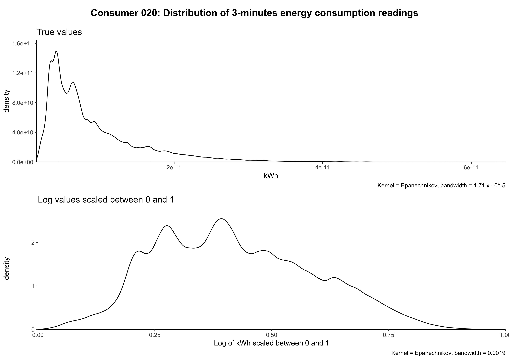

[](http://quantlet.de/)

## [](http://quantlet.de/) **BLEMplotScaling** [](http://quantlet.de/)

```yaml


Name of Quantlet: BLEMplotScaling

Published in: Forecasting in blockchain-based smart grids: Testing a prerequisite for the implementation of local energy markets

Description: Plots exemplary the density function of one household's raw energy consumption values and the density function its log energy consumption values scaled between 0 and 1 for a LSTM neural network.

Keywords: household energy prediction, energy consumption, LSTM, machine learning, hyperparameter tuning, Keras, TensorFlow, data scaling, lineplot, density, log-values
Author: Michael Kostmann

See also:
- BLEMdataGlimpse
- BLEMdescStatEnergyData
- BLEMevaluateEnergyPreds
- BLEMevaluateMarketSim
- BLEMmarketSimulation
- BLEMplotEnergyData
- BLEMplotEnergyPreds
- BLEMplotPredErrors
- BLEMpredictLASSO
- BLEMpredictNaive
- BLEMtuneLSTM

Submitted:  26.10.2018
```



### R Code
```r


## Plot densities of single energy time series
## Author: Michael Kostmann


# Load packages
packages  = c("cowplot")
invisible(lapply(packages, library, character.only = TRUE))

# Load user-defined functions
functions = c("FUN_getData.R")
invisible(lapply(functions, source))

# Function for easy string pasting
"%&%" = function(x, y) {paste(x, y, sep = "")}


# Specify path and dataset
path = "../data/consumer/"
id   = "consumer-00000020"

# Load data
data = getData(path   = path,
               data   = "single",
               id     = id,
               return = "consumption")

# Values of log-train_data to scale to 0/1-interval
data_min = min(log(data[, 2]))
data_max = max(log(data[, 2]))

# Prepare plotting
names(data) = c("time", "cons")
c           = substring(id, 15,17)

# Plotting
p_title1 = ggdraw() + 
    draw_label("Consumer "%&%c%&%": Distribution of 3-minute"%&%
                      "energy consumption readings",
               size     = 16,
               fontface = "bold")

p1 = ggplot(data, aes(cons*10^-10)) +
    stat_density(color  = "black",
                 fill   = NA,
                 bw     = "SJ",
                 adjust = 2,
                 kernel = "epanechnikov") +
    theme_classic(base_size = 12) +
    scale_x_continuous(expand = c(0, 0)) +
    scale_y_continuous(expand = expand_scale(mult = c(0, 0.1))) +
    ylab("density") +
    xlab("kWh") +
    labs(title   = "True values",
         caption = "Kernel = Epanechnikov, bandwidth = 1.71 x 10^-5")

p3 = ggplot(data, aes((log(cons)-data_min)/(data_max-data_min))) +
    stat_density(color  = "black",
                 fill   = NA,
                 bw     = "SJ",
                 adjust = 2,
                 kernel = "epanechnikov") +
    theme_classic(base_size = 12) +
    scale_x_continuous(expand = c(0, 0)) +
    scale_y_continuous(expand = expand_scale(mult = c(0, 0.1))) +
    ylab("density") +
    xlab("Log of kWh scaled between 0 and 1") +
    labs(title   = "Log values scaled between 0 and 1",
         caption = "Kernel = Epanechnikov, bandwidth = 0.0019")

plot_grid(p_title1, p1, p3, ncol = 1, rel_heights = c(0.15, 1, 1))
ggsave("c"%&%c%&%"_density.jpg", height = 8.267, width = 11.692)


## end of script##

```

automatically created on 2018-10-26